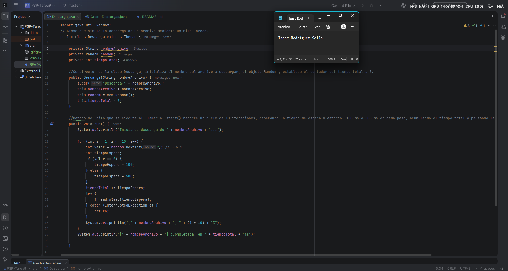
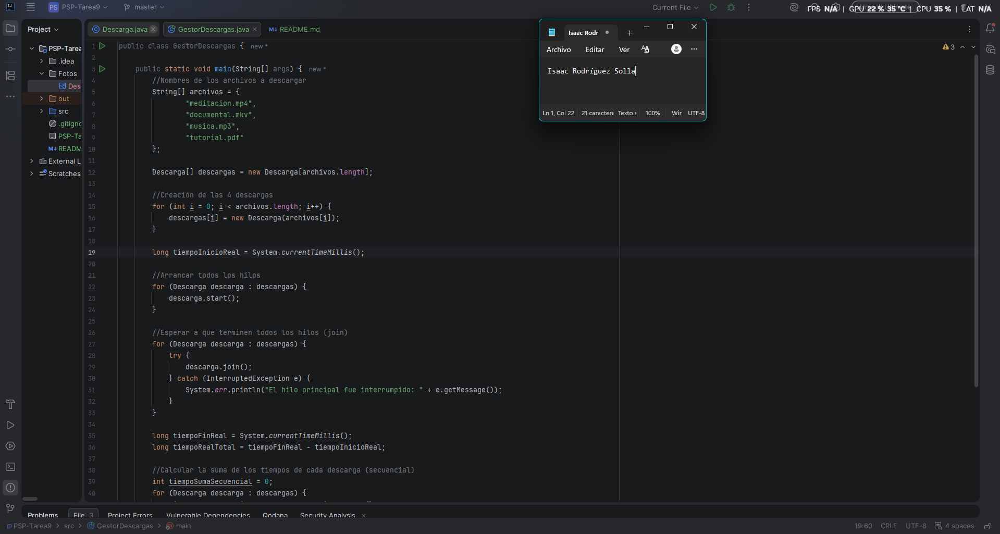
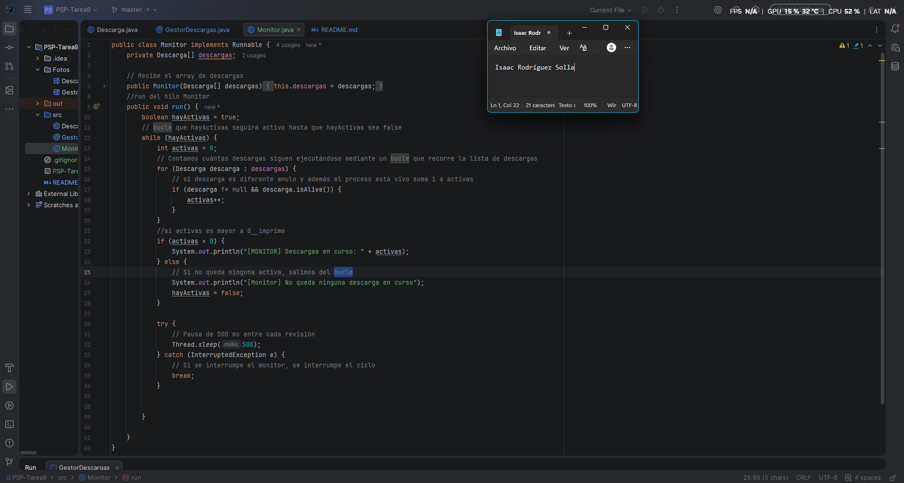
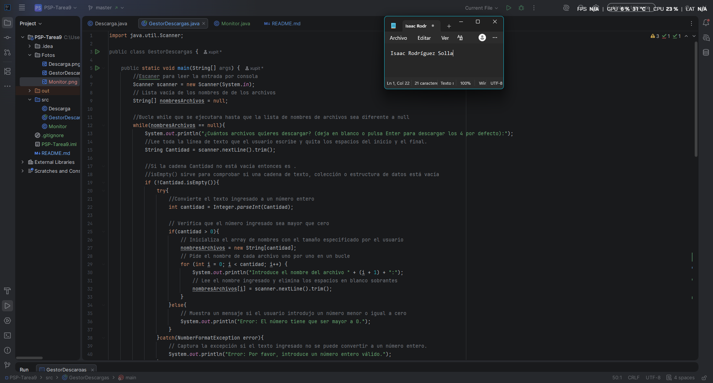
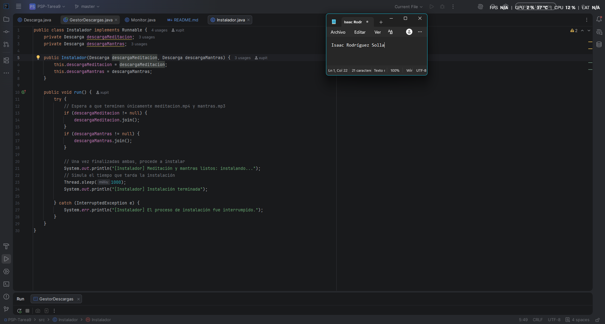
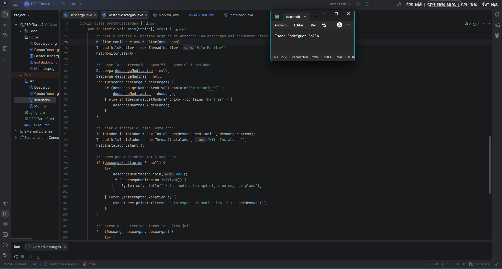

# Tarea 09
## Nivel 1-3
### Nivel 1
#### Clase Descarga
Para simular la descarga concurrente de un archivo, creé la clase `Descarga` heredando de `Thread` e implementando un constructor que le asigna un nombre personalizado al hilo mediante `super()`, además de inicializar el generador de números aleatorios `Random` y el contador `tiempoTotal`. La lógica principal la programé dentro del método sobrescrito `run()`, donde utilicé un bucle para simular el avance del archivo en 10 tramos progresivos del 10% al 100%; en cada paso del bucle, simulo las variaciones y latencias de la red asignando aleatoriamente una pausa de 100 ms o 500 ms mediante `Thread.sleep()`. Durante este proceso, voy acumulando cada intervalo de tiempo en el atributo `tiempoTotal`, imprimo el porcentaje actual por pantalla y gestiono la excepción `InterruptedException` para cancelar la ejecución de forma limpia si el hilo es interrumpido. Finalmente, al concluir el ciclo muestro el mensaje de finalización e incluyo los métodos `getTiempoTotal()` y `getNombreArchivo()` para que el hilo principal pueda consultar la duración acumulada y los metadatos de la descarga una vez terminada.


Código
```java
import java.util.Random;
// Clase que simula la descarga de un archivo mediante un hilo Thread.
public class Descarga extends Thread {

    private String nombreArchivo;
    private Random random;
    private int tiempoTotal;

    //Constructor de la clase Descarga, inicializa el nombre del archivo a descargar, el objeto Random y establece el contador del tiempo total a 0.
    public Descarga(String nombreArchivo) {
        super("Descarga-" + nombreArchivo);
        this.nombreArchivo = nombreArchivo;
        this.random = new Random();
        this.tiempoTotal = 0;
    }

    //Metodo del hilo que se ejecuta al llamar a .start(),recorre un bucle de 10 iteraciones, generando un tiempo de espera aleatorio  100 ms o 500 ms en cada paso, acumulando el tiempo total y pausando la ejecución con Thread.sleep().
    public void run() {
        System.out.println("Iniciando descarga de " + nombreArchivo + "...");

        for (int i = 1; i <= 10; i++) {
            int valor = random.nextInt(2); // 0 o 1
            int tiempoEspera;
            if (valor == 0) {
                tiempoEspera = 100;
            } else {
                tiempoEspera = 500;
            }
            tiempoTotal += tiempoEspera;
            try {
                Thread.sleep(tiempoEspera);
            } catch (InterruptedException e) {
                return;
            }
            System.out.println("[" + nombreArchivo + "] " + (i * 10) + "%");
        }
        System.out.println("[" + nombreArchivo + "] ¡Completada! en " + tiempoTotal + "ms");

    }

    //Devuelve el tiempo total acumulado que duró la descarga en milisegundos.
    public int getTiempoTotal() {
        return tiempoTotal;
    }
    //Devuelve el nombre del archivo
    public String getNombreArchivo() {
        return this.nombreArchivo;
    }
}

```
#### Clase GestorDescargas
En el programa principal `GestorDescargas`, creé un array con los nombres de los cuatro archivos que quería bajar e instancié un objeto de mi clase `Descarga` para cada uno de ellos. Luego, usé un bucle para arrancar todos los hilos al mismo tiempo llamando al método `.start()`, justo después de guardar la hora de inicio con `System.currentTimeMillis()`. Para asegurarme de que el programa no terminara antes de tiempo, puse un segundo bucle utilizando `.join()` con su correspondiente `try-catch`, lo que obliga al hilo principal a esperar a que cada descarga finalice. Una vez que todas terminaron, calculé el tiempo total real que tomó el proceso y recorrí las descargas con `getTiempoTotal()` para sumar sus tiempos individuales, imprimiendo al final los mensajes con la comparativa entre el tiempo real en paralelo y lo que habría tardado en modo secuencial.

```java
public class GestorDescargas {

    public static void main(String[] args) {
        //Nombres de los archivos a descargar
        String[] archivos = {
                "meditacion.mp4",
                "documental.mkv",
                "musica.mp3",
                "tutorial.pdf"
        };

        Descarga[] descargas = new Descarga[archivos.length];

        //Creación de las 4 descargas
        for (int i = 0; i < archivos.length; i++) {
            descargas[i] = new Descarga(archivos[i]);
        }

        long tiempoInicioReal = System.currentTimeMillis();

        //Arrancar todos los hilos
        for (Descarga descarga : descargas) {
            descarga.start();
        }

        //Esperar a que terminen todos los hilos (join)
        for (Descarga descarga : descargas) {
            try {
                descarga.join();
            } catch (InterruptedException e) {
                System.err.println("El hilo principal fue interrumpido: " + e.getMessage());
            }
        }

        long tiempoFinReal = System.currentTimeMillis();
        long tiempoRealTotal = tiempoFinReal - tiempoInicioReal;

        //Calcular la suma de los tiempos de cada descarga (secuencial)
        int tiempoSumaSecuencial = 0;
        for (Descarga descarga : descargas) {
            tiempoSumaSecuencial += descarga.getTiempoTotal();
        }

        //Imprimir resultados finales
        System.out.println("Todas las descargas han terminado.");
        System.out.println("Tiempo real transcurrido (en paralelo): " + tiempoRealTotal + " ms");
        System.out.println("Tiempo estimado si fuera una detrás de otra (secuencial): " + tiempoSumaSecuencial + " ms");
    }
}
```

<u>Preguntas a la IA en el nivel 1:</u>
¿Cómo puedo calcular el tiempo que tarda en ejecutarse un trozo de código en Java?

Para medir la duración de un bloque de código en Java se utiliza el método estático System.currentTimeMillis(), el cual devuelve el tiempo actual en milisegundos. El procedimiento consiste en guardar el valor inicial en una variable de tipo long justo antes de empezar la tarea que se quiere evaluar, capturar nuevamente el tiempo de la misma forma al finalizar el proceso, y restar ambos valores (tiempoFinal - tiempoInicial) para obtener la duración exacta transcurrida en milisegundos.


##### Pruebas del Nivel 1:
| **Ejecución** | **Descarga más lenta** | **Tiempo real(ms)** | **Suma** |
|:---:|:----------------------:|:-------------------:|:--------:|
|1|         3400ms         |       4206 ms       | 14800 ms |
|2|         2600ms         |       3410 ms       | 12000 ms |
|3|         2200ms         |       4607 ms       | 12400 ms |
* ¿Por qué el tiempo real es mucho menor que la suma?

  El tiempo real es mucho menor porque todas las descargas se hacen a la vez y al mismo tiempo gracias a los hilos, así que el programa solo tarda lo que le lleve terminar a la más lenta; en cambio, la suma calcula lo que tardaría si tuvieras que esperar a que termine una para recién empezar la siguiente.

* ¿Qué pasa si hacéis `start()` y `join()` dentro del mismo bucle?
  Si ejecutamos `start()` y `join()` en el mismo bucle, el programa se vuelve totalmente secuencial: el hilo principal inicia la primera descarga y se frena a esperar a que termine antes de pasar a la siguiente, haciendo que se procesen una detrás de otra y elevando el tiempo real a la suma de todas

Código:
```java
public class GestorDescargas {

    public static void main(String[] args) {
        String[] archivos = {
                "meditacion.mp4",
                "documental.mkv",
                "musica.mp3",
                "tutorial.pdf"
        };

        Descarga[] descargas = new Descarga[archivos.length];

        for (int i = 0; i < archivos.length; i++) {
            descargas[i] = new Descarga(archivos[i]);
        }

        long tiempoInicioReal = System.currentTimeMillis();

        //  start() y join() dentro del mismo bucle
        for (Descarga descarga : descargas) {
            try {
                descarga.start(); // Inicia el hilo
                descarga.join();  // Obliga al main a esperar a que termine ANTES de pasar al siguiente hilo
            } catch (InterruptedException e) {
                System.err.println("El hilo principal fue interrumpido: " + e.getMessage());
            }
        }

        long tiempoFinReal = System.currentTimeMillis();
        long tiempoRealTotal = tiempoFinReal - tiempoInicioReal;

        int tiempoSumaSecuencial = 0;
        for (Descarga descarga : descargas) {
            tiempoSumaSecuencial += descarga.getTiempoTotal();
        }

        System.out.println("Todas las descargas han terminado.");
        System.out.println("Tiempo real transcurrido (en paralelo simulado): " + tiempoRealTotal + " ms");
        System.out.println("Tiempo estimado si fuera una detrás de otra (secuencial): " + tiempoSumaSecuencial + " ms");
    }
}
```
Resultado
```terminaloutput
Iniciando descarga de meditacion.mp4...
[meditacion.mp4] 10%
[meditacion.mp4] 20%
[meditacion.mp4] 30%
[meditacion.mp4] 40%
[meditacion.mp4] 50%
[meditacion.mp4] 60%
[meditacion.mp4] 70%
[meditacion.mp4] 80%
[meditacion.mp4] 90%
[meditacion.mp4] 100%
[meditacion.mp4] ¡Completada! en 3800ms
Iniciando descarga de documental.mkv...
[documental.mkv] 10%
[documental.mkv] 20%
[documental.mkv] 30%
[documental.mkv] 40%
[documental.mkv] 50%
[documental.mkv] 60%
[documental.mkv] 70%
[documental.mkv] 80%
[documental.mkv] 90%
[documental.mkv] 100%
[documental.mkv] ¡Completada! en 3800ms
Iniciando descarga de musica.mp3...
[musica.mp3] 10%
[musica.mp3] 20%
[musica.mp3] 30%
[musica.mp3] 40%
[musica.mp3] 50%
[musica.mp3] 60%
[musica.mp3] 70%
[musica.mp3] 80%
[musica.mp3] 90%
[musica.mp3] 100%
[musica.mp3] ¡Completada! en 2600ms
Iniciando descarga de tutorial.pdf...
[tutorial.pdf] 10%
[tutorial.pdf] 20%
[tutorial.pdf] 30%
[tutorial.pdf] 40%
[tutorial.pdf] 50%
[tutorial.pdf] 60%
[tutorial.pdf] 70%
[tutorial.pdf] 80%
[tutorial.pdf] 90%
[tutorial.pdf] 100%
[tutorial.pdf] ¡Completada! en 3000ms

Todas las descargas han terminado.
Tiempo real transcurrido (en paralelo simulado): 13229 ms
Tiempo estimado si fuera una detrás de otra (secuencial): 13200 ms

Process finished with exit code 0
```

### Nivel 2
#### Clase Monitor

En la clase `Monitor`, implementé la interfaz `Runnable` para crear un hilo secundario que supervisa en tiempo real el estado del proceso. Dentro del método `run()`, utilicé un bucle `while` controlado por una variable booleana para evaluar periódicamente un array de objetos `Descarga`, usando el método `isAlive()` para contar cuántos hilos siguen ejecutándose de forma activa. Si detecto descargas en curso, el monitor imprime por consola la cantidad de archivos pendientes y realiza una pausa de 500 ms con `Thread.sleep()`; cuando compruebo que la cuenta de descargas activas llega a cero o si el hilo sufre una interrupción, cambio la bandera a `false` para dar por finalizada la supervisión.


```java
public class Monitor implements Runnable {
    private Descarga[] descargas;

    // Recibe el array de descargas
    public Monitor(Descarga[] descargas) {
        this.descargas = descargas;
    }
    //run del hilo Monitor
    public void run() {
        boolean hayActivas = true;
        // bucle que hayActivas seguirá activo hasta que hayActivas sea false
        while (hayActivas) {
            int activas = 0;
            // Contamos cuántas descargas siguen ejecutándose mediante un bucle que recorre la lista de descargas
            for (Descarga descarga : descargas) {
                // si descarga es diferente anulo y además el proceso está vivo suma 1 a activas
                if (descarga != null && descarga.isAlive()) {
                    activas++;
                }
            }
            //si activas es mayor a 0  imprime
            if (activas > 0) {
                System.out.println("[MONITOR] Descargas en curso: " + activas);
            } else {
                // Si no queda ninguna activa, salimos del bucle
                System.out.println("[Monitor] No queda ninguna descarga en curso");
                hayActivas = false;
            }

            try {
                // Pausa de 500 ms entre cada revisión
                Thread.sleep(500);
            } catch (InterruptedException e) {
                // Si se interrumpe el monitor, se interrumpe el ciclo
                break;
            }


        }

    }
}
```
#### Clase GestorDescargas Modificación

En el programa principal `GestorDescargas`, añadí un `Scanner` dentro de un bucle `while` para solicitar interactivamente al usuario la cantidad y los nombres de los archivos a descargar, asignando cuatro nombres por defecto en caso de dejar la entrada en blanco. Tras inicializar y arrancar el array de objetos `Descarga`, integré la clase `Monitor` envolviéndola en un hilo secundario e iniciándolo inmediatamente después de las descargas para supervisar en paralelo su progreso. Además, incluí una llamada a `hiloMonitor.join()` dentro del bloque de espera para asegurar que el hilo principal no imprima la comparativa final de tiempos hasta que tanto el monitor como todas las descargas hayan concluido por completo.


```java
import java.util.Scanner;

public class GestorDescargas {

    public static void main(String[] args) {
        //Escaner para leer la entrada por consola
        Scanner scanner = new Scanner(System.in);
        // Lista vacía de los nombres de de los archivos
        String[] nombresArchivos = null;

        //Bucle while que se ejecutara hasta que la lista de nombres de archivos sea diferente a null
        while(nombresArchivos == null){
            System.out.println("¿Cuántos archivos quieres descargar? (deja en blanco o pulsa Enter para descargar los 4 por defecto):");
            //Lee toda la línea de texto que el usuario escribe y quita los espacios del inicio y el final.
            String Cantidad = scanner.nextLine().trim();

            //Si la cadena Cantidad no está vacía entonces es .
            //isEmpty() sirve para comprobar si una cadena de texto, colección o estructura de datos está vacía
            if (!Cantidad.isEmpty()){
                try{
                    //Convierte el texto ingresado a un número entero
                    int cantidad = Integer.parseInt(Cantidad);

                    // Verifica que el número ingresado sea mayor que cero
                    if(cantidad > 0){
                        // Inicializa el array de nombres con el tamaño especificado por el usuario
                        nombresArchivos = new String[cantidad];
                        // Pide el nombre de cada archivo uno por uno en un bucle
                        for (int i = 0; i < cantidad; i++) {
                            System.out.println("Introduce el nombre del archivo " + (i + 1) + ":");
                            // Lee el nombre ingresado y elimina los espacios en blanco sobrantes
                            nombresArchivos[i] = scanner.nextLine().trim();
                        }
                    }else{
                        // Muestra un mensaje si el usuario introdujo un número menor o igual a cero
                        System.out.println("Error: El número tiene que ser mayor a 0.");
                    }
                }catch(NumberFormatException error){
                    // Captura la excepción si el texto ingresado no se puede convertir a un número entero.
                    System.out.println("Error: Por favor, introduce un número entero válido.");
                }
            }else{
                //Nombres de los archivos a descargar predefinidos
                nombresArchivos = new String[]{
                        "cuarzos.png",
                        "meditacion.mp4",
                        "horoscopo.pdf",
                        "mantras.mp3"
                };

            }

        }


        //Contar la cantidad de archivos que se van a descargar
        int totalDescargas = nombresArchivos.length;
        //Creación de la lista de objetos descarga con los espacios suficientes de de nombres de archivos
        Descarga[] descargas = new Descarga[totalDescargas];
        //Creacion de los objetos dentro de la lista
        for (int i = 0; i < totalDescargas; i++) {
            descargas[i] = new Descarga(nombresArchivos[i]);
        }

        // Medición de tiempo real con reloj del sistema
        long tiempoInicioReal = System.currentTimeMillis();

        //Arrancar todos los hilos
        for (Descarga descarga : descargas) {
            descarga.start();
        }
        //Crear e iniciar el monitor después de arrancar las descargas así encuentra hilos vivos
        Monitor monitor = new Monitor(descargas);
        Thread hiloMonitor = new Thread(monitor, "Hilo-Monitor");
        hiloMonitor.start();

        //Esperar a que terminen todos los hilos join
        for (Descarga descarga : descargas) {
            try {
                descarga.join();
                hiloMonitor.join();
            } catch (InterruptedException e) {
                System.err.println("El hilo principal fue interrumpido: " + e.getMessage());
            }
        }


        long tiempoFinReal = System.currentTimeMillis();
        long tiempoRealTotal = tiempoFinReal - tiempoInicioReal;

        //Calcular la suma de los tiempos de cada descarga (secuencial)
        int tiempoSumaSecuencial = 0;
        for (Descarga descarga : descargas) {
            tiempoSumaSecuencial += descarga.getTiempoTotal();
        }

        //Imprimir resultados finales
        System.out.println("Todas las descargas han terminado.");
        System.out.println("Tiempo real transcurrido (en paralelo): " + tiempoRealTotal + " ms");
        System.out.println("Tiempo estimado si fuera una detrás de otra (secuencial): " + tiempoSumaSecuencial + " ms");
    }
}
```
### Nivel 3
#### Clase Instalador
Como clase `Instalador`, implemento la interfaz `Runnable` para simular un proceso de instalación en un hilo secundario que depende de otros hilos: en mi método `run()`, utilizo `.join()` para bloquear mi ejecución y esperar activamente a que finalicen las descargas de dos archivos específicos (`descargaMeditacion` y `descargaMantras`); una vez completadas ambas, muestro un mensaje por consola, simulo el tiempo del proceso de instalación haciendo una pausa de 1000 milisegundos con `Thread.sleep(1000)` y concluyo informando que la instalación ha terminado, todo ello protegido por un bloque `try-catch` para gestionar posibles interrupciones.


```java
public class Instalador implements Runnable {
    private Descarga descargaMeditacion;
    private Descarga descargaMantras;

    public Instalador(Descarga descargaMeditacion, Descarga descargaMantras) {
        this.descargaMeditacion = descargaMeditacion;
        this.descargaMantras = descargaMantras;
    }

    public void run() {
        try {
            // Espera a que terminen únicamente meditacion.mp4 y mantras.mp3
            if (descargaMeditacion != null) {
                descargaMeditacion.join();
            }
            if (descargaMantras != null) {
                descargaMantras.join();
            }

            // Una vez finalizadas ambas, procede a instalar
            System.out.println("[Instalador] Meditación y mantras listos: instalando...");
            // Simula el tiempo que tarda la instalación
            Thread.sleep(1000);
            System.out.println("[Instalador] Instalación terminada");

        } catch (InterruptedException e) {
            System.err.println("[Instalador] El proceso de instalación fue interrumpido.");
        }
    }
}
```
#### Clase GestorDescargas
Primero preparo el hilo del instalador pasándole las referencias de las descargas que necesita y lo arranco en paralelo con `.start()`. Justo después, hago una pausa controlada en el hilo principal con `descargaMeditacion.join(3000)` para esperar a que termine `meditacion.mp4`, pero con un límite estricto de 3 segundos (3000 milisegundos); si en ese tiempo no ha finalizado, compruebo su estado con `.isAlive()` para confirmar que sigue activa y muestro un mensaje informando que la descarga continúa ejecutándose en segundo plano.


```java
import java.util.Scanner;

public class GestorDescargas {

    public static void main(String[] args) {
        //Escaner para leer la entrada por consola
        Scanner scanner = new Scanner(System.in);
        // Lista vacía de los nombres de de los archivos
        String[] nombresArchivos = null;

        //Bucle while que se ejecutara hasta que la lista de nombres de archivos sea diferente a null
        while(nombresArchivos == null){
            System.out.println("¿Cuántos archivos quieres descargar? (deja en blanco o pulsa Enter para descargar los 4 por defecto):");
            //Lee toda la línea de texto que el usuario escribe y quita los espacios del inicio y el final.
            String Cantidad = scanner.nextLine().trim();

            //Si la cadena Cantidad no está vacía entonces es .
            //isEmpty() sirve para comprobar si una cadena de texto, colección o estructura de datos está vacía
            if (!Cantidad.isEmpty()){
                try{
                    //Convierte el texto ingresado a un número entero
                    int cantidad = Integer.parseInt(Cantidad);

                    // Verifica que el número ingresado sea mayor que cero
                    if(cantidad > 0){
                        // Inicializa el array de nombres con el tamaño especificado por el usuario
                        nombresArchivos = new String[cantidad];
                        // Pide el nombre de cada archivo uno por uno en un bucle
                        for (int i = 0; i < cantidad; i++) {
                            System.out.println("Introduce el nombre del archivo " + (i + 1) + ":");
                            // Lee el nombre ingresado y elimina los espacios en blanco sobrantes
                            nombresArchivos[i] = scanner.nextLine().trim();
                        }
                    }else{
                        // Muestra un mensaje si el usuario introdujo un número menor o igual a cero
                        System.out.println("Error: El número tiene que ser mayor a 0.");
                    }
                }catch(NumberFormatException error){
                    // Captura la excepción si el texto ingresado no se puede convertir a un número entero.
                    System.out.println("Error: Por favor, introduce un número entero válido.");
                }
            }else{
                //Nombres de los archivos a descargar predefinidos
                nombresArchivos = new String[]{
                        "cuarzos.png",
                        "meditacion.mp4",
                        "horoscopo.pdf",
                        "mantras.mp3"
                };

            }

        }


        //Contar la cantidad de archivos que se van a descargar
        int totalDescargas = nombresArchivos.length;
        //Creación de la lista de objetos descarga con los espacios suficientes de de nombres de archivos
        Descarga[] descargas = new Descarga[totalDescargas];
        //Creacion de los objetos dentro de la lista
        for (int i = 0; i < totalDescargas; i++) {
            descargas[i] = new Descarga(nombresArchivos[i]);
        }

        // Medición de tiempo real con reloj del sistema
        long tiempoInicioReal = System.currentTimeMillis();

        //Arrancar todos los hilos
        for (Descarga descarga : descargas) {
            descarga.start();
        }
        //Crear e iniciar el monitor después de arrancar las descargas así encuentra hilos vivos
        Monitor monitor = new Monitor(descargas);
        Thread hiloMonitor = new Thread(monitor, "Hilo-Monitor");
        hiloMonitor.start();

        //Buscar las referencias específicas para el Instalador
        Descarga descargaMeditacion = null;
        Descarga descargaMantras = null;
        for (Descarga descarga : descargas) {
            if (descarga.getNombreArchivo().contains("meditacion")) {
                descargaMeditacion = descarga;
            } else if (descarga.getNombreArchivo().contains("mantras")) {
                descargaMantras = descarga;
            }
        }

        // Crear e iniciar el hilo Instalador
        Instalador instalador = new Instalador(descargaMeditacion, descargaMantras);
        Thread hiloInstalador = new Thread(instalador, "Hilo-Instalador");
        hiloInstalador.start();

        //Espera por meditacion.mp4 3 segundos
        if (descargaMeditacion != null) {
            try {
                descargaMeditacion.join(3000);
                if (descargaMeditacion.isAlive()) {
                    System.out.println("[Main] meditacion.mp4 sigue en segundo plano");
                }
            } catch (InterruptedException e) {
                System.err.println("Error en la espera de meditación: " + e.getMessage());
            }
        }

        //Esperar a que terminen todos los hilos join
        for (Descarga descarga : descargas) {
            try {
                descarga.join();
                hiloMonitor.join();
                hiloInstalador.join();
            } catch (InterruptedException e) {
                System.err.println("El hilo principal fue interrumpido: " + e.getMessage());
            }
        }


        long tiempoFinReal = System.currentTimeMillis();
        long tiempoRealTotal = tiempoFinReal - tiempoInicioReal;

        //Calcular la suma de los tiempos de cada descarga (secuencial)
        int tiempoSumaSecuencial = 0;
        for (Descarga descarga : descargas) {
            tiempoSumaSecuencial += descarga.getTiempoTotal();
        }

        //Imprimir resultados finales
        System.out.println("Todas las descargas han terminado.");
        System.out.println("Tiempo real transcurrido (en paralelo): " + tiempoRealTotal + " ms");
        System.out.println("Tiempo estimado si fuera una detrás de otra (secuencial): " + tiempoSumaSecuencial + " ms");
    }
}
```
